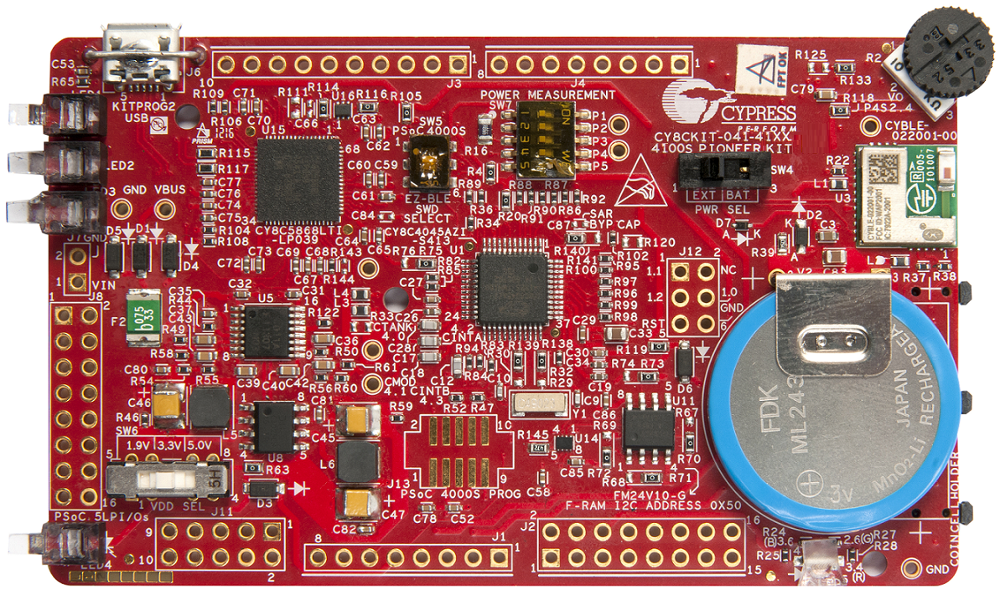

# CY8CKIT-041-41XX BSP

## Overview

The PSoC 4100S Pioneer Kit enables you to evaluate and develop with Cypress's fourth-generation, low-power CapSense solution using the PSoC 4100S device.

To use code from the BSP, simply include a reference to `cybsp.h`.

## Features

### Kit Features:

* Ready-to-Use CapSense Trackpad
* EZ-BLE PRoC module
* Potentiometer
* Rechargeable coin-cell battery

### Kit Contents:

* CY8CKIT-041-41XX PSoC 4100S Pioneer board
* USB Standad-A to Micro-B cable
* Water dropper
* Four press-fit connectors (for Arduino headers)
* Four jumper wires
* Quick Start Guide

## BSP Configuration

The BSP has a few hooks that allow its behavior to be configured. Some of these items are enabled by default while others must be explicitly enabled. Items enabled by default are specified in the CY8CKIT-041-41XX.mk file. The items that are enabled can be changed by creating a custom BSP or by editing the application makefile.

Components:
    * Device specific HAL reference (e.g.: PSOC6HAL) - This component, enabled by default, pulls in the version of the HAL that is applicable for this board.
    * BSP_DESIGN_MODUS - This component, enabled by default, causes the Configurator generated code for this specific BSP to be included. This should not be used at the same time as the CUSTOM_DESIGN_MODUS component.
    * CUSTOM_DESIGN_MODUS - This component, disabled by default, causes the Configurator generated code from the application to be included. This assumes that the application provides configurator generated code. This should not be used at the same time as the BSP_DESIGN_MODUS component.

Defines:
    * CYBSP_WIFI_CAPABLE - This define, disabled by default, causes the BSP to initialize the interface to an onboard wireless chip.
    * CY_USING_HAL - This define, enabled by default, specifies that the HAL is intended to be used by the application. This will cause the BSP to include the applicable header file and to initialize the system level drivers.

### Clock Configuration

| Clock    | Source    | Output Frequency |
|----------|-----------|------------------|
| IMO      |           | 48.0 MHz         |
| CLK_HF   | CLK_IMO   | 48 MHz           |

### Power Configuration

## API Reference Manual

The CY8CKIT-041-41XX Board Support Package provides a set of APIs to configure, initialize and use the board resources.

See the [BSP API Reference Manual][api] for the complete list of the provided interfaces.

## More information
* [CY8CKIT-041-41XX BSP API Reference Manual][api]
* [CY8CKIT-041-41XX Documentation](https://www.cypress.com/documentation/development-kitsboards/cy8ckit-041-41xx-psoc-4100s-capsense-pioneer-kit)
* [Cypress Semiconductor, an Infineon Technologies Company](http://www.cypress.com)
* [Cypress Semiconductor GitHub](https://github.com/cypresssemiconductorco)
* [ModusToolbox](https://www.cypress.com/products/modustoolbox-software-environment)

[api]: https://cypresssemiconductorco.github.io/TARGET_CY8CKIT-041-41XX/html/modules.html

---
© Cypress Semiconductor Corporation, 2019-2020.